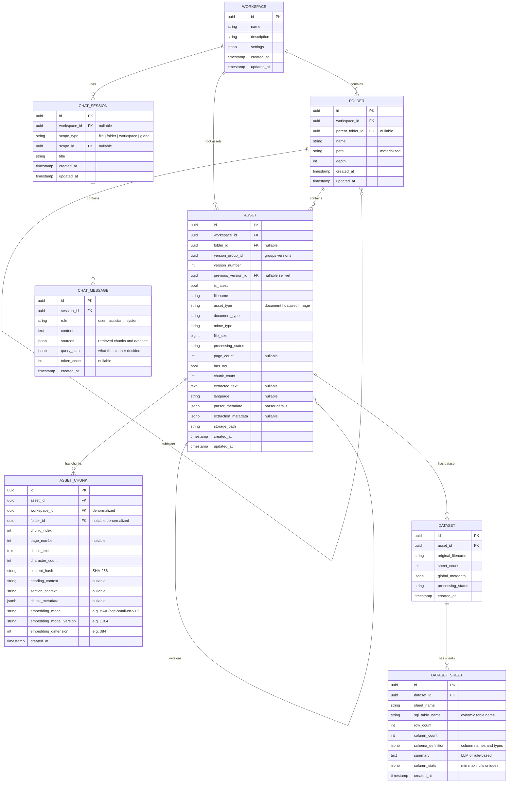

# Database Entity-Relationship Diagram (ERD)

Extracted from Architecture Design Document v2.1.

```mermaid
erDiagram
    WORKSPACE ||--o{ FOLDER : contains
    WORKSPACE ||--o{ ASSET : "root assets"
    WORKSPACE ||--o{ CHAT_SESSION : has
    FOLDER ||--o{ FOLDER : "subfolder"
    FOLDER ||--o{ ASSET : contains
    ASSET ||--o{ ASSET : "versions"
    ASSET ||--o{ ASSET_CHUNK : "has chunks"
    ASSET ||--o{ DATASET : "has dataset"
    DATASET ||--o{ DATASET_SHEET : "has sheets"
    CHAT_SESSION ||--o{ CHAT_MESSAGE : contains

    WORKSPACE {
        uuid id PK
        string name
        string description
        jsonb settings
        timestamp created_at
        timestamp updated_at
    }

    FOLDER {
        uuid id PK
        uuid workspace_id FK
        uuid parent_folder_id FK "nullable"
        string name
        string path "materialized"
        int depth
        timestamp created_at
        timestamp updated_at
    }

    ASSET {
        uuid id PK
        uuid workspace_id FK
        uuid folder_id FK "nullable"
        uuid version_group_id "groups versions"
        int version_number
        uuid previous_version_id FK "nullable self-ref"
        bool is_latest
        string filename
        string asset_type "document | dataset | image"
        string document_type
        string mime_type
        bigint file_size
        string processing_status
        int page_count "nullable"
        bool has_ocr
        int chunk_count
        text extracted_text "nullable"
        string language "nullable"
        jsonb parser_metadata "parser details"
        jsonb extraction_metadata "nullable"
        string storage_path
        timestamp created_at
        timestamp updated_at
    }

    ASSET_CHUNK {
        uuid id PK
        uuid asset_id FK
        uuid workspace_id FK "denormalized"
        uuid folder_id FK "nullable denormalized"
        int chunk_index
        int page_number "nullable"
        text chunk_text
        int character_count
        string content_hash "SHA-256"
        string heading_context "nullable"
        string section_context "nullable"
        jsonb chunk_metadata "nullable"
        string embedding_model "e.g. BAAI/bge-small-en-v1.5"
        string embedding_model_version "e.g. 1.0.4"
        int embedding_dimension "e.g. 384"
        timestamp created_at
    }

    DATASET {
        uuid id PK
        uuid asset_id FK
        string original_filename
        int sheet_count
        jsonb global_metadata
        string processing_status
        timestamp created_at
    }

    DATASET_SHEET {
        uuid id PK
        uuid dataset_id FK
        string sheet_name
        string sql_table_name "dynamic table name"
        int row_count
        int column_count
        jsonb schema_definition "column names and types"
        text summary "LLM or rule-based"
        jsonb column_stats "min max nulls uniques"
        timestamp created_at
    }

    CHAT_SESSION {
        uuid id PK
        uuid workspace_id FK "nullable"
        string scope_type "file | folder | workspace | global"
        uuid scope_id FK "nullable"
        string title
        timestamp created_at
        timestamp updated_at
    }

    CHAT_MESSAGE {
        uuid id PK
        uuid session_id FK
        string role "user | assistant | system"
        text content
        jsonb sources "retrieved chunks and datasets"
        jsonb query_plan "what the planner decided"
        int token_count "nullable"
        timestamp created_at
    }
```
